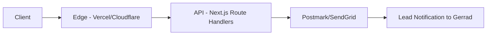

# Backend Logic (BL)
> Kraken Air & Electrical - Infrastructure & Security

---

## 1. Architecture



| Layer | Technology | Purpose |
|-------|------------|---------|
| **Edge** | Vercel / Cloudflare | CDN, caching, DDoS protection |
| **API** | Next.js Route Handlers | Form processing, validation |
| **Email** | Postmark / SendGrid | Lead notifications |

---

## 2. CSP, CORS & Browser Sandbox Security

### Content Security Policy (CSP)

```http
Content-Security-Policy: 
  script-src 'self' 'strict-dynamic';
  object-src 'none';
  base-uri 'self';
  frame-ancestors 'none';
```

### Cookie Security

| Cookie | Attributes |
|--------|------------|
| `__Host-Session-Token` | `SameSite=Strict; Secure; HttpOnly; Path=/` |

> [!CAUTION]
> All session tokens must use the `__Host-` prefix to prevent domain/path attacks.

---

## 3. Edge Orchestration

### Postcode Validation
Input validation for Perth postcodes to ensure Gerrad only receives leads within his service area.

```typescript
const VALID_POSTCODES = [
  // Joondalup region
  6027, 6028, 6029,
  // Wanneroo region
  6065, 6066, 6067,
  // Extended northern suburbs
  6030, 6031, 6032
];

function isServiceArea(postcode: number): boolean {
  return VALID_POSTCODES.includes(postcode);
}
```

---

## 6. Agentic Content Deletion Spec

> [!WARNING]
> User-submitted address data must be scrubbed from logs after **30 days** to maintain high privacy standards.

### Retention Policy

| Data Type | Retention | Action |
|-----------|-----------|--------|
| Contact form submissions | 30 days | Auto-delete from logs |
| Address data | 30 days | Verified scrub |
| Lead metadata (anonymized) | 12 months | Aggregated analytics only |

### Deletion Trigger
```typescript
// Scheduled job: daily at 02:00 AWST
async function scrubExpiredData() {
  const cutoffDate = new Date();
  cutoffDate.setDate(cutoffDate.getDate() - 30);
  
  await db.logs.deleteMany({
    type: 'user_address',
    createdAt: { $lt: cutoffDate }
  });
}
```
