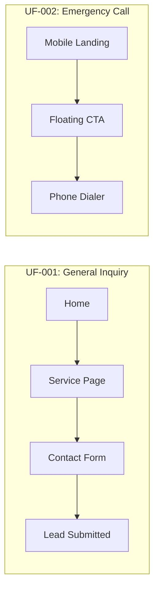

# User Flows (UF)
> Kraken Air & Electrical - Conversion Pathways

---

## 1. Flow Index

| ID | Flow Name | Path |
|----|-----------|------|
| **UF-001** | General Inquiry | Home → Service → Form |
| **UF-002** | Emergency Call | Mobile Landing → Floating CTA → Dialer |



---

## 2. URL-Driven State Machine

| URL | Intent State |
|-----|--------------|
| `/services/air-conditioning#booking` | Direct state for AC repair intent |
| `/services/electrical#booking` | Direct state for electrical intent |

### Deep Link Behavior
- Hash `#booking` auto-scrolls to booking form
- Pre-populates service type based on URL segment

---

## 3. Hydration & Skeleton UX

> [!IMPORTANT]
> The Kraken logo and "Call Now" button will render as an SVG/HTML skeleton to ensure the user can act within **0.5s** of page load.

### Priority Hydration Order
1. Logo SVG (inline)
2. Phone CTA button
3. Navigation
4. Service cards
5. Testimonials

---

## 7. Animation & Micro-interactions

### The "Thinking" State
A subtle **tentacle-pulse animation** during form submission to maintain brand engagement.

```css
@keyframes tentacle-pulse {
  0%, 100% { transform: scale(1); opacity: 0.8; }
  50% { transform: scale(1.05); opacity: 1; }
}

.form-submitting .kraken-logo {
  animation: tentacle-pulse 1.5s ease-in-out infinite;
}
```
